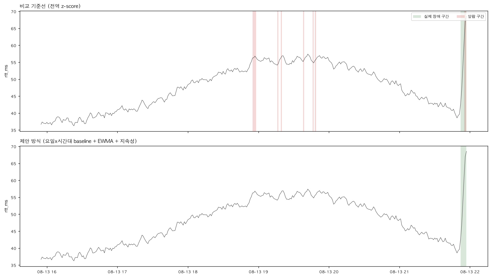
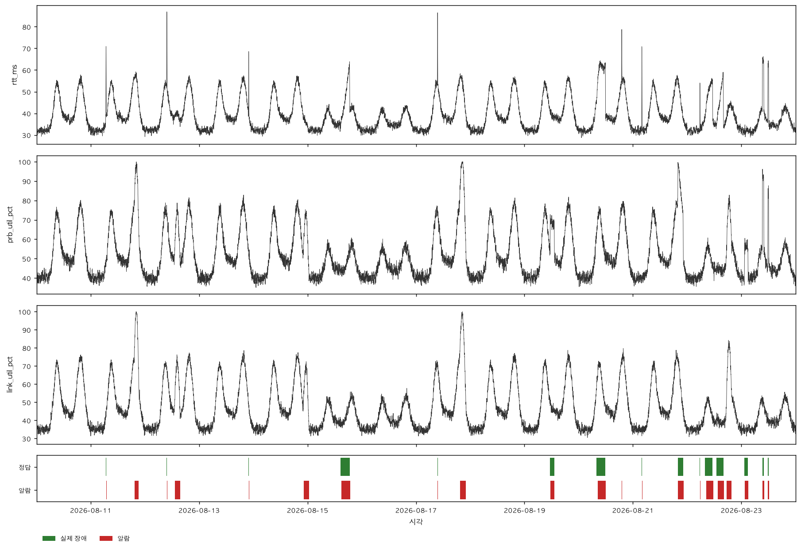

# kpi-sentinel

실시간 KPI 이상징후 탐지 파이프라인. 이동통신망 품질 지표를 예제 도메인으로 사용한다.

계절성을 반영하지 않는 단순 임계값 방식 대비 **오탐을 약 77% 줄이면서 장애 미탐 0건**을 유지한다. 알람이 발생한 근거를 지표 단위로 남기고, 언어 모델이 이를 운용자용 리포트로 서술한다.

| 지표 | 비교 기준선 | 제안 방식 |
|---|---|---|
| F1 | 0.530 ± 0.055 | **0.863 ± 0.038** |
| Recall | 0.856 ± 0.074 | **1.000 ± 0.000** |
| 오탐 건수 | 20.4 ± 4.4 | **4.7 ± 1.5** |
| 평균 탐지 지연 | - | 13.7분 |

seed 7개 반복 측정. 비교 기준선은 전역 z-score, 제안 방식은 요일×시간대 baseline + EWMA + 지속성 규칙. 상세 실험 결과는 [docs/results.md](docs/results.md) 참조.

---

## 무엇을 해결하는가

운용 현장에서 이상탐지의 실패는 두 방향으로 나타난다. 장애를 놓치거나, 정상 상황에 알람이 울려 아무도 알람을 보지 않게 되거나.

이 프로젝트는 후자에 초점을 맞춘다. 세 가지 원인을 각각 처리한다.

**계절성** — 출퇴근 시간대의 정상적인 트래픽 증가를 이상으로 판정하는 문제. 요일 유형과 시간대로 나눈 버킷마다 정상 범위를 따로 학습한다.

**단발성 노이즈** — 정규분포 꼬리에서 나오는 일시적 이탈. 연속 N회 위반한 경우에만 알람을 발생시킨다. 오탐이 줄어드는 대신 탐지가 늦어지는 교환 관계가 있다.

**정상적인 부하 급증** — 트래픽이 늘어 부하 지표가 오르지만 서비스 품질은 유지되는 상황. 부하 지표와 품질 지표를 함께 보아 구분한다.



같은 구간에서 기준선(위)은 정상적인 저녁 트래픽 상승에 5건의 오탐을 냈고, 제안 방식(아래)은 오탐 없이 오른쪽 끝의 실제 장애만 탐지했다.

---

## 아키텍처

```
                    ┌─ [배치] run_window.py ──────┐
시뮬레이터 → CSV ───┤                             ├─→ 탐지 → 평가
                    └─ [스트림] Redpanda ─────────┘        │
                       produce → consume                   ▼
                                                      DuckDB 적재
                                                           │
                                                           ▼
                                              시각화 · LLM 장애 리포트
```

윈도우 집계는 배치와 스트림 두 경로로 실행할 수 있으며, 같은 구현을 공유하므로 결과가 일치한다. 탐지 이후 결과가 두 경로에서 동일함을 확인했다. 브로커를 파일 재생으로 교체해도 하위 단계는 변경되지 않는다.

### 디렉토리

```
kpi-sentinel/
├─ config/            # 모든 파라미터. 코드에 상수를 두지 않는다
│  ├─ kpi.yaml        #   KPI 정의: 기준값, 노이즈, 계절성 진폭, direction
│  ├─ scenarios.yaml  #   이상 시나리오 5종: 강도, 지속시간, 발생 횟수
│  ├─ detector.yaml   #   윈도우 크기, z 임계값, EWMA 계수, 지속성
│  ├─ stream.yaml     #   브로커 접속, 입력 경로 선택
│  ├─ storage.yaml    #   DuckDB 경로와 테이블 이름
│  ├─ report.yaml     #   모델 이름, 도메인 지식
│  └─ plot.yaml       #   시각화 대상과 크기
│
├─ sentinel/          # 도메인 비의존. KPI의 의미를 알지 못한다
│  ├─ simulator.py    #   계절성 생성, 이상 주입, 라벨링
│  ├─ stream.py       #   스트림 소스 추상
│  ├─ windowing.py    #   슬라이딩 윈도우 집계
│  ├─ detector.py     #   baseline z-score, EWMA, 지속성 규칙
│  ├─ evaluate.py     #   event-wise 평가
│  ├─ storage.py      #   DuckDB 적재와 조회
│  ├─ report.py       #   수치 요약과 리포트 생성
│  └─ plotting.py     #   시각화
│
├─ scripts/           # 실행 진입점
├─ docs/              # 실험 결과와 그림
└─ docker-compose.yml # Redpanda
```

`sentinel/` 아래에는 도메인 용어가 등장하지 않는다. RSRP, SINR 같은 지표 이름과 그 의미는 전부 `config/`에 있다. 다른 도메인에 적용하려면 `config/`의 YAML만 교체하면 된다.

```bash
grep -rniE "통신|네트워크|RSRP|SINR|RTT|PRB" sentinel/   # 결과 없음
```

---

## KPI와 시나리오

**무선** SINR, PRB 점유율, 호 접속 성공률
**유선** RTT, 패킷 손실률, 지터, 링크 사용률

| 시나리오 | 라벨 | 특징 |
|---|---|---|
| spike | 이상 | 짧고 강하게 튄다 |
| gradual_degradation | 이상 | 수 시간에 걸쳐 서서히 악화 |
| node_down | 이상 | 부하와 품질이 동시에 무너진다 |
| config_change | 이상 | 변화 폭이 작아 탐지 난도가 높다 |
| traffic_surge | **정상** | 부하만 오르고 품질은 유지되는 함정 |

`traffic_surge`는 라벨이 0이지만 값은 크게 변한다. 계절성이나 부하만 보는 탐지기가 오탐을 내는지 확인하는 대조군이다.

---

## 실행

### 준비

```bash
python3 -m venv .venv
source .venv/bin/activate
pip install pandas numpy matplotlib pyyaml duckdb anthropic \
            python-dotenv confluent-kafka

cp .env.example .env      # ANTHROPIC_API_KEY 입력 (리포트 생성 시에만 필요)
```

### 배치 경로 (브로커 불필요)

```bash
python scripts/run_simulate.py        # 데이터 생성
python scripts/validate_simulator.py  # 시뮬레이터 검증
python scripts/run_window.py          # 윈도우 집계
python scripts/run_detect.py          # 탐지
python scripts/run_evaluate.py        # 성능 지표
python scripts/run_store.py           # DuckDB 적재
python scripts/run_plot.py            # 시각화
python scripts/run_report.py --scenario node_down   # LLM 리포트
```

### 스트림 경로

```bash
docker compose up -d
docker exec -it kpi-sentinel-redpanda rpk topic create kpi-raw -p 1 -r 1

python scripts/run_produce.py         # CSV를 토픽으로 전송
python scripts/run_consume.py         # 수신하며 윈도우 집계
```

`config/stream.yaml`의 `windowed_source`를 `stream`으로 바꾸면 탐지 단계가 스트림 집계 결과를 읽는다.

데이터를 다시 생성한 경우 토픽을 초기화해야 한다. 그러지 않으면 하류가 옛 레코드를 읽는다.

```bash
docker exec -it kpi-sentinel-redpanda rpk topic delete kpi-raw
docker exec -it kpi-sentinel-redpanda rpk topic create kpi-raw -p 1 -r 1
docker exec -it kpi-sentinel-redpanda rpk group delete kpi-sentinel
```

### 실험

```bash
python scripts/run_sweep.py       # 파라미터별 성능 변화
python scripts/run_multiseed.py   # seed 7개 반복 측정
python scripts/run_sparsity.py    # 장애 밀도별 거동
```

---

## 설계 판단

### 딥러닝을 쓰지 않는다

운용에서는 알람이 왜 울렸는지 설명할 수 있어야 한다. 탐지 결과에는 어떤 지표가 임계를 넘었는지를 기록한 `trigger` 컬럼이 함께 남는다.

정상 트래픽 급증 구간에서는 알람 149건 전부가 부하 지표로만 발생했고, 노드 장애 구간에서는 알람 32건 중 30건이 부하와 품질 지표 조합으로 발생했다. 이 차이가 `trigger` 값에 그대로 드러난다.

### 판정은 규칙이, 서술은 언어 모델이

리포트 생성 초기에는 KPI별 이탈폭만 전달했다. 이 상태에서 언어 모델은 정상 트래픽 증가 구간을 "셀 용량 부족"으로 결론지었다. 프롬프트에 판단 기준을 명시해도 바뀌지 않았다.

해결은 데이터 구조에서 나왔다. 탐지기가 판정한 임계 초과 여부를 사실로 함께 전달하자 판단이 바뀌었다. 수치는 SQL로 확정하고 판정은 규칙 기반 탐지기가 내리며, 언어 모델은 확정된 사실을 서술한다.

### event-wise 평가

장애 구간의 길이가 8분에서 360분까지 차이가 크다. 시점 단위로 채점하면 긴 장애 하나가 짧은 장애 수십 개만큼의 가중치를 갖는다. 장애 구간 안에서 알람이 한 번 이상 발생하면 탐지 성공으로 보고, 오탐은 연속된 알람 덩어리 하나를 1건으로 센다.

### 파라미터는 최고 성능이 아니라 근거로 선택

`z_threshold=4.0`이 F1은 더 높았으나 근거가 이 데이터셋 하나뿐이다. 3.0은 3σ라는 통계적 관례가 뒷받침한다. `persistence`는 recall이 무너지는 경계에서 두 칸 아래 값을 택했다.

### 시뮬레이터도 검증 대상

자체 생성 데이터를 쓰므로 데이터 자체가 의도대로인지 확인해야 한다. `scripts/validate_simulator.py`가 네 가지를 판정한다.

1. baseline 학습 구간에 이상이 섞이지 않았는가
2. 정상 시나리오가 모든 장애보다 작게 튀는가
3. 정상 트래픽 증가에서 부하와 품질 지표가 분리되는가
4. 가장 단순한 탐지기 기준으로 난이도가 적절한가

이 검증이 실제로 두 번 설계 결함을 잡아냈다. 초기 설정에서는 정상 시나리오가 실제 장애보다 크게 튀어 구분이 불가능했고, 이후 발생 횟수를 범위로 바꾸면서 seed에 따라 순서가 뒤집히는 문제가 드러났다.



---

## 한계

- 자체 시뮬레이터를 사용하며 실제 망 데이터가 아니다. 시점 간 자기상관과 KPI 간 물리적 결합을 모델링하지 않았으므로, 실제 데이터보다 탐지가 쉬운 조건이다.
- 실제 망의 장애 발생 빈도를 참조할 데이터가 없어 맞추지 못했다. 대신 밀도를 3배 이상 변화시켜도 성능이 유지되는지 확인했다.
- 오탐 감소율은 장애 밀도에 따라 69% ~ 89%로 변한다. 단일 수치가 아니라 범위로 보아야 한다.
- 파라미터 조정과 반복 측정에 같은 시뮬레이터를 사용했다. 시뮬레이터의 가정이 틀렸다면 반복 측정으로도 드러나지 않는다.

---

## 스택

| 기술 | 용도 |
|---|---|
| Python | 전체 파이프라인 |
| Redpanda | 스트림 수집. Kafka API 호환 브로커 |
| DuckDB | 알람 이력 저장과 조회 |
| matplotlib | 탐지 결과 시각화 |
| Anthropic API | 장애 리포트 서술 (Claude Haiku) |